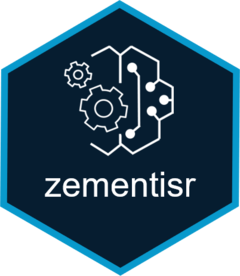

<!-- README.md is generated from README.Rmd. Please edit that file -->

# zementisr 

[](https://travis-ci.org/alex23lemm/zementisr)
[](https://codecov.io/github/alex23lemm/zementisr?branch=master)

zementisr is an R client for the Zementis Server API. Zementis Server is
an execution engine for PMML models which also comes with model
management capabilities. Using zementisr, data scientists can deploy
PMML models to Zementis Server, predict new values by sending data to
the server and manage the entire PMML model life cycle without leaving
their preferred R development environment.

## Installation

``` r
# install.packages("devtools")
devtools::install_github("alex23lemm/zementisr")
```

## Usage

zementisr deploys PMML models to Zementis Server and manages the model
lifecycle. Below are some of the things you can do once you have
converted your R prediction model to PMML.

Check out the [quickstart
guide](https://alex23lemm.github.io/zementisr/articles/zementisr.html)
and [the
docs](https://alex23lemm.github.io/zementisr/reference/index.html) for
further details.

``` r
library(pmml)

# Build a simple lm model and convert it to PMML
iris_lm <- lm(Sepal.Length ~ ., data=iris)
iris_pmml <- pmml(iris_lm, model_name = "iris_model")


library(zementisr)

# Deploy PMML model to Zementis Server
upload_model(iris_pmml)
#> $model_name
#> [1] "iris_model"
#> 
#> $is_active
#> [1] TRUE

# Get prediction for new value from Zementis Server
predict_pmml(iris[42, ], "iris_model")
#> $model
#> [1] "iris_model"
#> 
#> $outputs
#>   Predicted_Sepal.Length
#> 1               4.295281

# Deactivate PMML model on Zementis Server
deactivate_model("iris_model")
#> $model_name
#> [1] "iris_model"
#> 
#> $is_active
#> [1] FALSE

# Activate PMML model on Zementis Server
activate_model("iris_model")
#> $model_name
#> [1] "iris_model"
#> 
#> $is_active
#> [1] TRUE

# Delete PMML model from Zementis Server
delete_model("iris_model")
#> character(0)
```

## Authentication

Zementis Server’s REST API uses HTTP Basic Authentication. For each
request the client needs to provide username and password.

The zementisr package requires that you store your secrets and the base
URL of your Zementis Server as environment variables in the `.Renviron`
file in your home directory.

Please, make sure to set the environment variables below in your
`.Renviron` file before using functions from the zementisr package. You
can easily edit `.Renviron` using `usethis::edit_r_environ()`.

``` r
ZEMENTIS_base_url = "[address]"
ZEMENTIS_usr = "[your_username]"
ZEMENTIS_pwd = "[your_password]"
```
